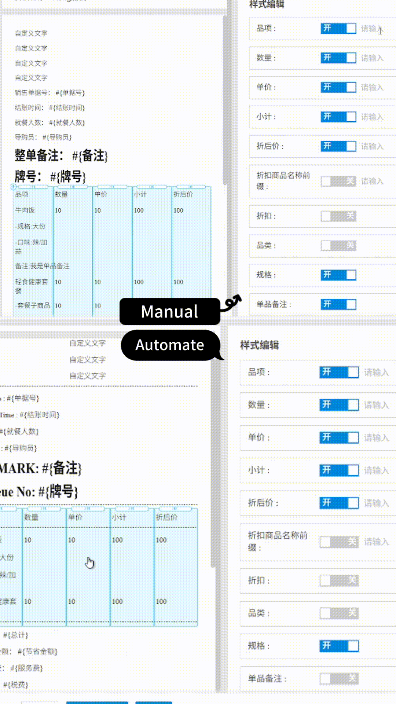

# POS Backend Task Automation (Power Automate Desktop)

> Internal automation tool built to eliminate repetitive manual operations in a web-based POS
> backend system, reducing daily operational overhead for non-technical staff.
> 

  

## Problem

The company's POS backend (a web-based admin panel at `beta9.pospal.cn`) requires staff to
perform the same multi-step, click-heavy sequence repeatedly throughout the day — a task that
is tedious, time-consuming, and prone to human error under time pressure.

## Tech Stack

| Layer | Technology |
|---|---|
| Automation engine | Power Automate Desktop (v2.69.00217.26166) |
| Target system | Web-based POS admin panel (browser automation) |
| Interaction model | Coordinate/index-based UI element targeting, mouse action sequencing |

## What It Does

A drag-and-drop-based automation flow that replicates a three-action mouse sequence a staff
member would otherwise perform manually, dozens of times a day, inside the POS backend.

## Engineering Challenges (in progress)

This project is a working proof of concept in active hardening, not a finished black box —
which is itself part of the value: it surfaces real constraints of PAD as an automation tool
that don't show up until you push it into production-adjacent use:

- **Element selector instability.** Index-based UI targeting breaks when the underlying page's
  DOM order shifts slightly between sessions — currently being replaced with more resilient
  selector strategies.
- **Window size sensitivity.** Coordinate-based interactions are sensitive to the browser
  window's exact dimensions, requiring either enforced window sizing or a move to
  selector-based targeting.
- **Off-screen targets.** Actions on elements outside the visible viewport require explicit
  scroll steps before the click/drag sequence, since PAD's recorder does not capture
  drag-and-drop actions natively.
- **Isolated testing discipline.** After an earlier incident where an untested variable rename
  broke a 100+ step production flow, new logic is now always built and validated in an isolated
  test flow before being merged into the main flow.

## Status

Functional beta, undergoing selector-stability hardening before wider rollout. Deliberately
scoped to backend operational tasks only — steps with business-sensitive consequences (e.g.
data import/export) remain human-triggered by design, not automated.

## About This Project

Self-initiated during a Diploma in IT internship (Network Security track) after observing
repetitive manual workload in the POS backend, and approved by the employer as an internal
efficiency tool.
